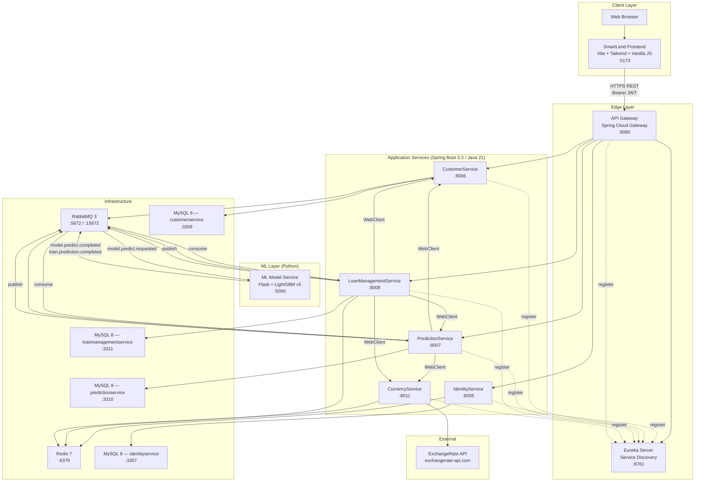
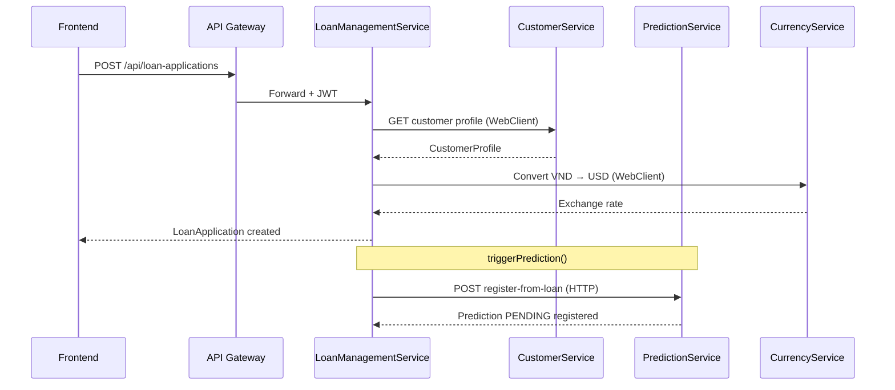
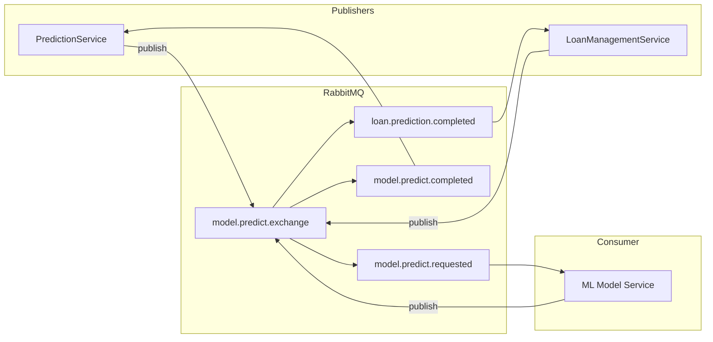
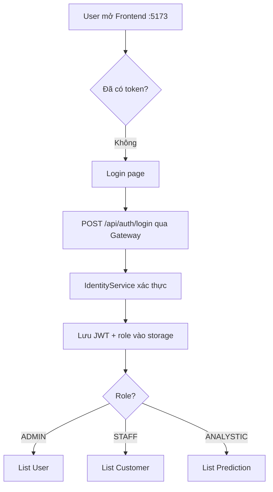
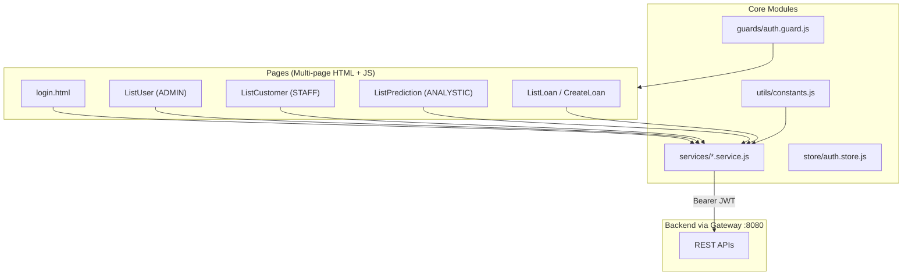
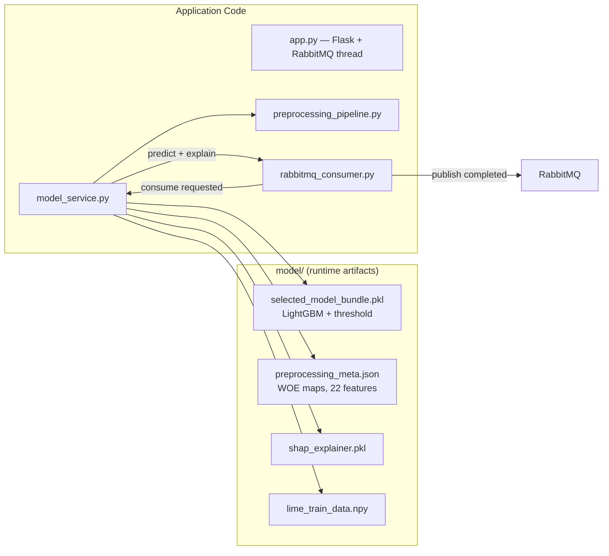
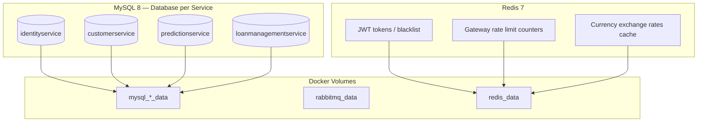
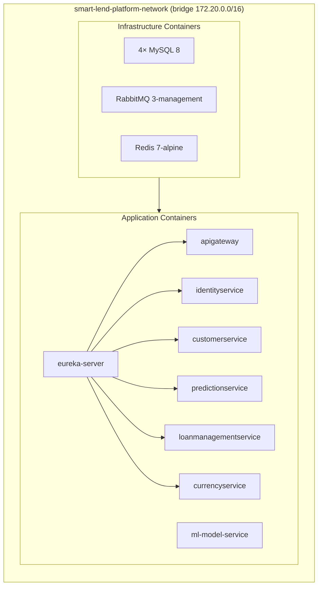
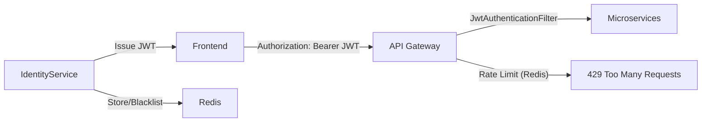

# SmartLend — Sơ đồ kiến trúc hệ thống

> Tài liệu mô tả kiến trúc tổng thể của **SmartLend Platform** (backend microservices) và **SmartLend Frontend** (CreditFlow UI), bao gồm công nghệ đóng gói và vận hành.

---

## 1. Tổng quan

SmartLend là nền tảng **quản lý cho vay thông minh** (Intelligent Credit Decision Platform), hỗ trợ:

- Xác thực & phân quyền nhân viên (`ADMIN`, `STAFF`, `ANALYSTIC`)
- Quản lý hồ sơ khách hàng và dữ liệu tài chính
- Dự đoán rủi ro vỡ nợ bằng mô hình ML (LightGBM v5)
- Quản lý đơn vay, quyết định phê duyệt và giải ngân

Hệ thống theo kiến trúc **microservices**, giao tiếp qua **HTTP (REST)** và **RabbitMQ (async)**, triển khai bằng **Docker Compose**.

---

## 2. Sơ đồ kiến trúc tổng thể



---

## 3. Stack công nghệ

### 3.1 Backend (`smartLend-platform`)

| Thành phần | Công nghệ | Phiên bản / Ghi chú |
|---|---|---|
| Ngôn ngữ | Java | 21 |
| Framework | Spring Boot | 3.3.4 |
| Microservices | Spring Cloud | 2023.0.3 |
| API Gateway | Spring Cloud Gateway | Reactive, routing + filter |
| Service Discovery | Netflix Eureka | Client-side load balancing (`lb://`) |
| Bảo mật | Spring Security + JWT (JJWT) | Access/Refresh token |
| ORM | Spring Data JPA | Hibernate |
| Database | MySQL | 8.0 — **database-per-service** |
| Message Broker | RabbitMQ | 3-management (AMQP + Management UI) |
| Cache | Redis | 7-alpine — token, rate limit, tỷ giá |
| HTTP client nội bộ | WebClient | Spring WebFlux |
| Build | Maven | Multi-module parent POM |
| Container | Docker | Multi-stage build (Maven → JRE 21 Alpine) |
| Orchestration | Docker Compose | `docker-compose.yml` — bridge network |

### 3.2 ML Model Service (`ml-model`)

| Thành phần | Công nghệ |
|---|---|
| Runtime | Python 3.11 |
| Web framework | Flask 3 |
| Model | LightGBM 4.1 (v5, threshold 0.256) |
| Preprocessing | WOE encoding + One-Hot + feature engineering |
| Explainability | SHAP + LIME |
| Messaging | Pika (RabbitMQ consumer/publisher) |
| Container | Docker (python:3.11-slim) |

### 3.3 Frontend (`frontend/`)

| Thành phần | Công nghệ |
|---|---|
| Build tool | Vite 6 |
| Styling | Tailwind CSS 3 |
| UI logic | Vanilla JavaScript (ES modules) |
| State | localStorage / sessionStorage |
| HTTP | Fetch API |
| Dev server | `:5173` |
| Production build | Static files → `dist/` |

---

## 4. Các service và trách nhiệm

| Service | Port | Database | Mô tả |
|---|---:|---|---|
| **Eureka Server** | 8761 | — | Service registry, health discovery |
| **API Gateway** | 8080 | — | Single entry point, CORS, JWT filter, rate limiting (Redis) |
| **IdentityService** | 8005 | mysql-identity | Login/logout/refresh, JWT, user profile, role-based access |
| **CustomerService** | 8006 | mysql-customer | CRUD hồ sơ khách hàng, import batch |
| **PredictionService** | 8007 | mysql-prediction | Tạo/lưu prediction, publish tới ML, nhận kết quả + SHAP/LIME |
| **LoanManagementService** | 8008 | mysql-loan-management | Đơn vay, financial snapshot, trigger ML, approve/reject, giải ngân |
| **CurrencyService** | 8011 | — (Redis cache) | Tỷ giá USD/VND từ API bên ngoài, phục vụ nội bộ |
| **ML Model Service** | 5000 | — (artifact files) | Inference LightGBM v5, async qua RabbitMQ + REST health/predict |

> **CurrencyService** không expose qua API Gateway — chỉ các service nội bộ gọi qua Eureka/WebClient.

---

## 5. API Gateway — Routing

Tất cả request từ frontend đi qua Gateway (`http://localhost:8080`):

| Route | Target Service | Path prefix |
|---|---|---|
| identity-service-auth | `lb://identityservice` | `/api/auth/**`, `/api/users-profiles/**` |
| customer-service | `lb://customerservice` | `/api/customers/**` |
| prediction-service | `lb://predictionservice` | `/api/predictions/**` |
| loan-management-service | `lb://loanmanagementservice` | `/api/loan-applications/**`, `/api/financial-snapshots/**`, `/api/disbursements/**` |

**Filters trên mọi route:**
- `JwtAuthenticationFilter` — xác thực Bearer token
- `RequestRateLimiter` — giới hạn tốc độ qua Redis
- CORS cho origin `http://localhost:5173`

---

## 6. Giao tiếp giữa các service

### 6.1 Đồng bộ (HTTP/REST)



### 6.2 Bất đồng bộ (RabbitMQ)

**Exchange:** `model.predict.exchange` (topic, durable)

| Routing Key | Publisher | Consumer | Mục đích |
|---|---|---|---|
| `model.predict.requested` | PredictionService, LoanManagementService | ML Model Service | Yêu cầu inference |
| `model.predict.completed` | ML Model Service | PredictionService | Kết quả + SHAP/LIME |
| `loan.prediction.completed` | ML Model Service | LoanManagementService | Kết quả luồng loan (khi có `loanApplicationId`) |



**Payload ML input** (11 trường camelCase): `personAge`, `personIncome`, `personHomeOwnership`, `personEmpLength`, `loanIntent`, `loanGrade`, `loanAmnt`, `loanIntRate`, `loanPercentIncome`, `cbPersonDefaultOnFile`, `cbPersonCredHistLength`.

---

## 7. Luồng nghiệp vụ chính

### 7.1 Đăng nhập & phân quyền



| Role | Trang mặc định sau login |
|---|---|
| `ADMIN` | Quản lý users/employees |
| `STAFF` | Quản lý customers, tạo đơn vay |
| `ANALYSTIC` | Xem danh sách predictions |

### 7.2 Dự đoán độc lập (PredictionService)

1. Staff/Analyst tạo prediction qua `/api/predictions`
2. PredictionService lấy profile từ CustomerService, convert VND→USD
3. Lưu bản ghi `PENDING`, publish `model.predict.requested`
4. ML Model Service inference + SHAP/LIME
5. Publish `model.predict.completed` → PredictionService cập nhật kết quả

### 7.3 Luồng đơn vay (LoanManagementService)

1. Staff tạo đơn vay → LMS lấy profile, tạo `FinancialSnapshot`, lưu đơn `UNDER_REVIEW`
2. Staff gọi `triggerPrediction(loanApplicationId)`
3. LMS đăng ký prediction PENDING tại PredictionService (HTTP)
4. LMS publish trực tiếp tới ML qua RabbitMQ (kèm `loanApplicationId`)
5. ML trả kết quả cho **cả** PredictionService và LoanManagementService
6. Staff ra quyết định approve/reject thủ công
7. Nếu approved → giải ngân qua `/api/disbursements`

---

## 8. Kiến trúc Frontend



**Cấu trúc thư mục chính:**

```
frontend/
├── src/
│   ├── pages/          # Màn hình theo domain (users, customers, loan, analytics)
│   ├── services/       # identity, customer, prediction, loanmanagement
│   ├── components/     # Sidebar, Navbar, Modal, Chart
│   ├── layouts/        # DashboardLayout, AuthLayout
│   ├── guards/         # auth.guard.js
│   ├── store/          # auth.store.js, prediction.store.js
│   └── utils/          # http, constants, roleRoutes, formatter
├── vite.config.js
└── package.json
```

**Biến môi trường (`.env`):**

```env
VITE_API_GATEWAY_URL=http://localhost:8080
# Hoặc override từng service nếu cần
```

---

## 9. ML Model Service — Kiến trúc runtime



| Artifact | Nội dung |
|---|---|
| Model v5 | LightGBM, 22 GA features, threshold **0.256** |
| Preprocessing | Impute → clip outliers → feature engineering → WOE → OHE |
| Explainability | SHAP TreeExplainer + LIME TabularExplainer |

---

## 10. Lưu trữ dữ liệu



Mỗi microservice sở hữu schema riêng — **không chia sẻ database** trực tiếp giữa các service.

---

## 11. Đóng gói & vận hành (Deployment)

### 11.1 Docker Compose topology

File: `smartLend-platform/docker-compose.yml`



**Khởi chạy backend:**

```bash
cd smartLend-platform
docker compose up --build
```

**Khởi chạy frontend (development):**

```bash
cd frontend
npm install
npm run dev    # http://localhost:5173
```

> Frontend **chưa** được đóng gói trong `docker-compose.yml` — chạy riêng bằng Vite dev server hoặc build static (`npm run build` → serve `dist/`).

### 11.2 Chiến lược build container

| Service | Base image (build) | Base image (runtime) | Đặc điểm |
|---|---|---|---|
| Java services | `maven:3.9.6-eclipse-temurin-21-alpine` | `eclipse-temurin:21-jre-alpine` | Multi-stage, non-root user, healthcheck curl |
| ML Model | — | `python:3.11-slim` | Copy artifacts + code, non-root `mluser` |

**Health checks:** Spring Actuator (`/actuator/health`), ML (`/health`), MySQL (`mysqladmin ping`), RabbitMQ (`rabbitmq-diagnostics ping`), Redis (`redis-cli ping`).

### 11.3 Cấu hình môi trường

File `.env` ở root `smartLend-platform` chứa:
- Credentials MySQL, RabbitMQ, Redis
- JWT secret, admin default account
- Database URLs cho từng service
- `MODEL_VERSION=5.0.0`
- `EUREKA_SERVER_URL`, `CURRENCY_API_URL`

### 11.4 Monitoring & quản trị

| Công cụ | URL / Endpoint | Mục đích |
|---|---|---|
| Eureka Dashboard | `http://localhost:8761` | Danh sách service đã đăng ký |
| RabbitMQ Management | `http://localhost:15672` | Queue, exchange, message flow |
| Spring Actuator | `/actuator/health`, `/actuator/metrics` | Health từng service |
| ML Health | `http://localhost:5000/health` | Model loaded, RabbitMQ status |
| Gateway Actuator | `/actuator/gateway/routes` | Xem cấu hình route |

---

## 12. Bảo mật



| Lớp | Cơ chế |
|---|---|
| Authentication | JWT access + refresh token |
| Token storage | Redis (IdentityService) — cache, blacklist on logout |
| Authorization | Role-based (`ADMIN`, `STAFF`, `ANALYSTIC`) — frontend route guard + backend security |
| API Gateway | JWT validation filter trước khi forward request |
| Rate limiting | Redis-backed token bucket per IP |
| Container | Non-root users, bridge network isolation |

---

## 13. Sơ đồ ports (Development)

| Thành phần | Port |
|---|---:|
| Frontend (Vite) | 5173 |
| API Gateway | 8080 |
| Eureka Server | 8761 |
| IdentityService | 8005 |
| CustomerService | 8006 |
| PredictionService | 8007 |
| LoanManagementService | 8008 |
| CurrencyService | 8011 |
| ML Model Service | 5000 |
| MySQL (identity) | 3307 |
| MySQL (customer) | 3309 |
| MySQL (prediction) | 3310 |
| MySQL (loan-management) | 3311 |
| RabbitMQ AMQP | 5672 |
| RabbitMQ Management UI | 15672 |
| Redis | 6379 |

---

## 14. Repository layout

```
smartLend-platform/                 # Backend monorepo (Maven parent)
├── apigateway/
├── eurekaserver/
├── identityservice/
├── customerservice/
├── predictionservice/
├── loanmanagementservice/
├── currencyservice/
├── ml-model/                       # Python ML service
├── frontend/                       # Vite multi-page UI (nginx in Docker/k8s)
├── k8s/                            # Kubernetes manifests (k3s)
├── scripts/                        # deploy, build, smoke tests
├── docker-compose.yml
├── pom.xml
├── .env
└── docs/
    └── ARCHITECTURE.md             # ← Tài liệu này
```

---

## 15. Ghi chú kiến trúc

1. **Database-per-service** — mỗi bounded context có MySQL riêng, đồng bộ dữ liệu qua API/events.
2. **ML inference async** — Java services không block chờ model; dùng RabbitMQ request/reply pattern.
3. **Dual publish từ ML** — luồng loan gửi kèm `loanApplicationId`, ML publish cả `model.predict.completed` và `loan.prediction.completed`.
4. **Currency conversion** — dữ liệu VND từ UI/DB được convert sang USD trước khi đưa vào model (khớp training dataset).
5. **Frontend trong monorepo** — `frontend/` cùng repo platform; gọi backend qua Gateway (CORS configured).
6. **k3s dev** — xem `k8s/README.md` và `docs/K3S_DEPLOYMENT_PLAN.md`; Compose vẫn dùng cho local dev.

---

*Tài liệu được sinh từ phân tích codebase `smartLend-platform` (bao gồm `frontend/`).*
