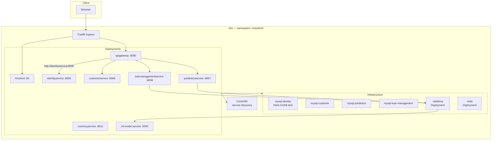
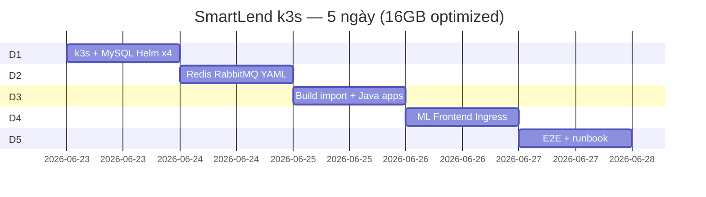

# Kế hoạch triển khai SmartLend Platform trên k3s

> **Phiên bản:** Dev Host 16GB Optimization  
> **Mục tiêu:** Triển khai k3s trên **một dev host 16GB RAM**, chạy mượt, tránh OOM, giữ **4 MySQL độc lập** và **Docker multi-stage build**, **không dùng Eureka** và **không dùng local registry**.

**Phạm vi:** Single-node k3s · dev host · 5 ngày · CoreDNS service discovery · `k3s ctr images import`

**Tham chiếu:** [`docker-compose.yml`](../docker-compose.yml) · [`.env`](../.env) · [`docs/ARCHITECTURE.md`](ARCHITECTURE.md)

---

## Mục lục

1. [Tổng quan](#1-tổng-quan)
2. [Yêu cầu dev host](#2-yêu-cầu-dev-host)
3. [Kiến trúc trên k3s](#3-kiến-trúc-trên-k3s)
4. [Timeline — 5 ngày](#4-timeline--5-ngày)
5. [Phase 0 — Nền tảng cluster](#5-phase-0--nền-tảng-cluster)
6. [Phase 1 — Infrastructure](#6-phase-1--infrastructure)
7. [Phase 2 — Application workloads](#7-phase-2--application-workloads)
8. [Phase 3 — Hardening & verification](#8-phase-3--hardening--verification)
9. [Mapping Docker Compose → Kubernetes](#9-mapping-docker-compose--kubernetes)
10. [Biến môi trường](#10-biến-môi-trường)
11. [Rủi ro & giảm thiểu](#11-rủi-ro--giảm-thiểu)
12. [Definition of Done](#12-definition-of-done)
13. [Phase tương lai](#13-phase-tương-lai)

---

## 1. Tổng quan

### 1.1 Hiện trạng (Compose)

| Hạng mục | Trạng thái |
|---|---|
| Orchestration | Docker Compose |
| Microservices | 7 Java + 1 Python (`ml-model`) |
| Service discovery (Compose) | Netflix Eureka |
| Message broker | RabbitMQ 3 |
| Cache | Redis 7 |
| Database | MySQL 8 × 4 |
| Edge | Spring Cloud Gateway `:8080` |
| Frontend | Vite — chưa trong Compose |

### 1.2 Mục tiêu chuyển đổi (bản tối ưu 16GB)

| Mục tiêu | Ghi chú |
|---|---|
| Lift & shift → k3s | Giữ 4 MySQL Helm, multi-stage Dockerfile |
| **Service discovery** | **K8s CoreDNS** — `[service].smartlend.svc.cluster.local` |
| **[Lược bỏ] Eureka** | Không deploy `eureka-server`; tắt Eureka client trên app |
| **[Lược bỏ] Local registry :5000** | `docker save \| k3s ctr images import` |
| Redis / RabbitMQ | **Deployment YAML thuần** (không Bitnami HA) |
| MySQL limits | **256Mi request / 512Mi limit** mỗi instance |
| Ingress Traefik (built-in k3s) | `smartlend.local` / `api.smartlend.local` |
| Secret / ConfigMap | Tách khỏi `.env` |
| Backup CronJob, NetworkPolicy | **Optional** → Phase tương lai |

### 1.3 Thay đổi so với bản kế hoạch trước

| Hạng mục | Trước | Bản này |
|---|---|---|
| Eureka | Deploy + `lb://` routes | **Bỏ** — Gateway trỏ thẳng `http://service:port` |
| Image delivery | Registry `:5000` + push | **`ctr images import`** |
| Redis / RabbitMQ | Helm Bitnami (StatefulSet) | **Deployment + PVC** YAML |
| RAM ước lượng | 12–16 GB | **8–10 GB** |
| Timeline | 10 ngày / 4 phase | **5 ngày** |
| Backup / NetPol | Bắt buộc Phase 3 | **Optional** |

### 1.4 Nguyên tắc map Compose → K8s

| Docker Compose | Kubernetes (dev host) |
|---|---|
| `build` multi-stage | Build trên host → `ctr images import` |
| `image` | `imagePullPolicy: IfNotPresent` hoặc `Never` |
| Service name | ClusterIP DNS (CoreDNS) |
| `.env` | ConfigMap + Secret |
| `depends_on` | `readinessProbe` + thứ tự deploy |

---

## 2. Yêu cầu dev host

| Tài nguyên | Tối thiểu | Ghi chú |
|---|---:|---|
| **RAM** | **16 GB** | Cluster target **~8–10 GB** working set |
| CPU | 4 core | 8 core thoải mái hơn khi build |
| Disk | 80 GB SSD | Image + 4 PVC MySQL |
| OS | Ubuntu 22.04/24.04 / Debian 12 | — |

**Phần mềm:** Docker (build), Git, kubectl, Helm 3 (chỉ cho MySQL).

**Port mở:**

| Port | Mục đích |
|---|---|
| 80, 443 | Ingress Traefik |
| 6443 | Kubernetes API (tuỳ chọn) |
| ~~5000~~ | ~~Local registry~~ — **không dùng** |

### Ước lượng RAM (sau tối ưu)

| Nhóm | RAM (limits) |
|---|---|
| 4× MySQL @ 512Mi | ~2.0 GB |
| Redis + RabbitMQ (Deployment) | ~512 Mi |
| 7× Java @ 768Mi limit, **-Xmx512m** heap | ~4.5 GB |
| ml-model-service @ 1.5Gi | ~1.5 GB |
| frontend + k3s system | ~1.5 GB |
| **Tổng (limits)** | **~8–10 GB** |
| Headroom trên host 16GB | ~6 GB cho OS + docker build |

> Limits ≠ usage thực tế; MySQL `requests: 256Mi` giú scheduler không overcommit.

---

## 3. Kiến trúc trên k3s



**Gọi nội bộ qua CoreDNS (short name trong cùng namespace):**

```
http://identityservice:8005
http://customerservice:8006
http://predictionservice:8007
http://loanmanagementservice:8008
http://currencyservice:8011
http://smart-lend-rabbitmq:5672
smart-lend-redis:6379
mysql-identity:3306
```

---

## 4. Timeline — 5 ngày

| Ngày | Phase | Nội dung |
|---|---|---|
| **D1** | 0 + 1a | Cài k3s, namespace, Secret/ConfigMap; Helm 4 MySQL (limits 512Mi) |
| **D2** | 1b | Redis + RabbitMQ YAML; verify infra connectivity |
| **D3** | 2a | Build all images + `ctr import`; patch Gateway (bỏ Eureka); deploy Java apps |
| **D4** | 2b | Deploy ml-model + frontend; Ingress; smoke test login |
| **D5** | 3 | E2E prediction/loan/ML; probes/resources; runbook gọn |



---

## 5. Phase 0 — Nền tảng cluster

### 5.1 Cài k3s

```bash
curl -sfL https://get.k3s.io | sh -s - --write-kubeconfig-mode 644
export KUBECONFIG=/etc/rancher/k3s/k3s.yaml
kubectl get nodes          # Ready
kubectl get storageclass     # local-path
```

### 5.2 Nạp image — `k3s ctr images import` (thay registry)

**Không** chạy `registry:2`, **không** mở port 5000, **không** cấu hình `registries.yaml`.

Sau khi build image trên host:

```bash
# Build (ví dụ)
docker build -f apigateway/Dockerfile -t smartlend/apigateway:dev .

# Import vào containerd của k3s
docker save smartlend/apigateway:dev | sudo k3s ctr images import -

# Kiểm tra
sudo k3s ctr images ls | grep smartlend
```

Trong Deployment:

```yaml
image: smartlend/apigateway:dev
imagePullPolicy: IfNotPresent   # hoặc Never nếu tag local-only
```

### 5.3 Cấu trúc repo

```
smartLend-platform/
├── k8s/
│   ├── base/
│   │   ├── namespace.yaml
│   │   ├── configmap.yaml
│   │   ├── secrets.example.yaml
│   │   ├── infra/
│   │   │   ├── redis.yaml
│   │   │   └── rabbitmq.yaml
│   │   └── apps/                 # Deployment + Service từng app
│   ├── overlays/dev-host/
│   │   ├── kustomization.yaml
│   │   └── ingress.yaml
│   └── helm/values/
│       ├── mysql-identity.yaml
│       ├── mysql-customer.yaml
│       ├── mysql-prediction.yaml
│       └── mysql-loan-management.yaml
├── scripts/
│   ├── build-all-images.sh       # build + ctr import (không push)
│   └── deploy-dev.sh
└── docs/
    └── K3S_DEPLOYMENT_PLAN.md
```

### 5.4 Deliverable D1 (Phase 0)

- [ ] k3s `Ready`
- [ ] Namespace `smartlend`
- [ ] Secret + ConfigMap mẫu (password **đã đổi** khỏi dev mặc định)

---

## 6. Phase 1 — Infrastructure

### 6.1 MySQL ×4 — Helm Bitnami (giữ nguyên, ép RAM)

```bash
helm repo add bitnami https://charts.bitnami.com/bitnami
helm install mysql-identity bitnami/mysql -n smartlend \
  -f k8s/helm/values/mysql-identity.yaml
```

**`k8s/helm/values/mysql-identity.yaml` (pattern — áp dụng cho cả 4):**

```yaml
fullnameOverride: mysql-identity
auth:
  database: identityservice
  username: identityuser
  existingSecret: smartlend-secrets
  secretKeys:
    userPasswordKey: IDENTITY_DB_PASSWORD
    rootPasswordKey: MYSQL_ROOT_PASSWORD
primary:
  persistence:
    enabled: true
    size: 5Gi
    storageClass: local-path
  resources:
    requests:
      memory: 256Mi
      cpu: 100m
    limits:
      memory: 512Mi
      cpu: 500m
```

Lặp: `mysql-customer`, `mysql-prediction`, `mysql-loan-management`.

### 6.2 Redis — Deployment YAML (không Helm)

File `k8s/base/infra/redis.yaml`:

```yaml
apiVersion: apps/v1
kind: Deployment
metadata:
  name: smart-lend-redis
  namespace: smartlend
spec:
  replicas: 1
  selector:
    matchLabels:
      app: smart-lend-redis
  template:
    metadata:
      labels:
        app: smart-lend-redis
    spec:
      containers:
        - name: redis
          image: redis:7-alpine
          args: ["redis-server", "--appendonly", "yes"]
          ports:
            - containerPort: 6379
          resources:
            requests: { memory: 128Mi, cpu: 50m }
            limits:   { memory: 256Mi, cpu: 200m }
          volumeMounts:
            - name: data
              mountPath: /data
      volumes:
        - name: data
          persistentVolumeClaim:
            claimName: redis-data
---
apiVersion: v1
kind: Service
metadata:
  name: smart-lend-redis
  namespace: smartlend
spec:
  selector:
    app: smart-lend-redis
  ports:
    - port: 6379
```

### 6.3 RabbitMQ — Deployment YAML (không Helm)

File `k8s/base/infra/rabbitmq.yaml` — single replica, management plugin:

```yaml
# Deployment + Service smart-lend-rabbitmq
# Image: rabbitmq:3-management
# Env: RABBITMQ_DEFAULT_USER/PASS từ Secret
# resources: requests 256Mi / limits 512Mi
# PVC: rabbitmq-data 5Gi
# ports: 5672 (AMQP), 15672 (management — chỉ port-forward debug)
```

> Không StatefulSet, không cluster — đủ cho dev host 16GB.

### 6.4 Verify infra (D2)

```bash
kubectl -n smartlend get pods
kubectl -n smartlend run dns-test --rm -it --image=busybox:1.36 -- \
  nslookup mysql-identity.smartlend.svc.cluster.local
```

### 6.5 Deliverable D2

- [ ] 4 MySQL Running, mỗi pod ≤512Mi limit
- [ ] Redis + RabbitMQ Running (Deployment)
- [ ] DNS resolve OK

---

## 7. Phase 2 — Application workloads

### 7.1 Thay đổi cấu hình — bỏ Eureka

**Không deploy** `eureka-server`.

#### API Gateway — route trực tiếp K8s Service

Thay `lb://` bằng URL cố định trong `application-k8s.properties`.

> **Lưu ý:** Profile `k8s` **thay thế** từng phần tử `routes[n]`, không merge field-by-field. Chỉ set `.uri` sẽ làm `predicates` rỗng → crash `must not be empty`. Phải copy **đầy đủ** id, uri, predicates, filters (xem `apigateway/src/main/resources/application-k8s.properties`).

```properties
# Ví dụ route 0 — mỗi route cần predicates + filters, không chỉ uri
spring.cloud.gateway.routes[0].id=identity-service-auth
spring.cloud.gateway.routes[0].uri=http://identityservice:8005
spring.cloud.gateway.routes[0].predicates[0]=Path=/api/auth/**,/api/users-profiles/**
# ... filters giống application.properties
```

Tắt Eureka client trên **tất cả** Spring apps:

```yaml
env:
  - name: EUREKA_CLIENT_ENABLED
    value: "false"
  - name: SPRING_CLOUD_DISCOVERY_ENABLED
    value: "false"
```

Hoặc profile `k8s` trong từng service (khuyến nghị commit nhỏ vào repo).

#### WebClient URLs (đã có sẵn — giữ nguyên hostname)

```
CUSTOMER_SERVICE_URL=http://customerservice:8006
PREDICTION_SERVICE_URL=http://predictionservice:8007
CURRENCY_SERVICE_URL=http://currencyservice:8011
```

### 7.2 Script build — `scripts/build-all-images.sh`

```bash
#!/usr/bin/env bash
set -euo pipefail
TAG="${1:-dev}"
REGISTRY_PREFIX="smartlend"

build_and_import() {
  local name=$1 dockerfile=$2 context=$3
  local image="${REGISTRY_PREFIX}/${name}:${TAG}"
  echo "==> Building ${image}"
  docker build -f "${dockerfile}" -t "${image}" "${context}"
  echo "==> Importing into k3s containerd"
  docker save "${image}" | sudo k3s ctr images import -
}

# Java services — context = repo root (không build eureka-server)
build_and_import apigateway     apigateway/Dockerfile .
build_and_import identityservice identityservice/Dockerfile .
# ... customerservice, predictionservice, loanmanagementservice, currencyservice

# ML model
build_and_import ml-model-service ml-model/Dockerfile ml-model/

# Frontend (repo smartLend-fe)
# docker build -t smartlend/frontend:dev -f frontend/Dockerfile ../smartLend-fe/frontend/
# docker save smartlend/frontend:dev | sudo k3s ctr images import -
```

**Không có** lệnh `docker push`.

### 7.3 Workloads & replicas (dev host 16GB)

| Deployment | Replicas | imagePullPolicy | Memory limit |
|---|---:|---|---|
| apigateway | 1 | IfNotPresent | 768Mi |
| identityservice | 1 | IfNotPresent | 768Mi |
| customerservice | 1 | IfNotPresent | 768Mi |
| predictionservice | 1 | IfNotPresent | 768Mi |
| loanmanagementservice | 1 | IfNotPresent | 768Mi |
| currencyservice | 1 | IfNotPresent | 768Mi |
| ml-model-service | 1 | IfNotPresent | 1536Mi |
| frontend | 1 | IfNotPresent | 128Mi |
| ~~eureka-server~~ | **0** | — | **Bỏ** |

**JVM (7 Java services):** `JAVA_OPTS="-Xms256m -Xmx512m"` trong Dockerfile + env manifest; K8s `limits.memory: 768Mi` (headroom cho metaspace/native off-heap).

### 7.4 Health probes

| Service | Path | initialDelaySeconds |
|---|---|---|
| Java | `/actuator/health` | 60–90 |
| ml-model | `/health` | 25 |

### 7.5 Frontend + Ingress

`/etc/hosts`:

```
<DEV_HOST_IP>  smartlend.local
<DEV_HOST_IP>  api.smartlend.local
```

Build FE: `VITE_API_GATEWAY_URL=http://api.smartlend.local` — Vite **multi-page** (`vite.config.js` phải khai báo tất cả `src/pages/**/*.html`, không chỉ `index.html`).

Gateway CORS: `CORS_ALLOWED_ORIGINS=http://smartlend.local`

### 7.6 Thứ tự deploy (D3–D4)

```text
1. ConfigMap + Secret
2. MySQL (Helm) — đã có từ D1
3. Redis + RabbitMQ — đã có từ D2
4. currencyservice, identityservice, customerservice
5. predictionservice, loanmanagementservice
6. ml-model-service (sau RabbitMQ Ready)
7. apigateway
8. frontend + Ingress
```

### 7.7 Deliverable D3–D4

- [ ] `sudo k3s ctr images ls` có đủ image `smartlend/*`
- [ ] Tất cả pod Running, **không** pod eureka
- [ ] `curl http://api.smartlend.local/actuator/health` → UP
- [ ] Login frontend OK

---

## 8. Phase 3 — Hardening & verification

### 8.1 Bắt buộc (D5)

- [ ] Secret không commit; password khác mặc định `.env`
- [ ] `resources.requests/limits` trên mọi Deployment
- [ ] Smoke test E2E (bảng dưới)
- [ ] `kubectl top pods -n smartlend` — không pod nào OOMKilled

### 8.2 Optional (chuyển Phase tương lai)

| Hạng mục | Lý do lược bỏ trên dev 16GB |
|---|---|
| CronJob backup MySQL | Giảm IOPS; backup thủ công khi cần |
| NetworkPolicy | Phức tạp; dev host single-node |
| Prometheus/Grafana | Tốn RAM |
| HPA | Không cần trên 1 node |

### 8.3 Smoke test checklist

| # | Test | Expected |
|---|---|---|
| 1 | Gateway health | UP |
| 2 | CoreDNS | `nslookup customerservice` từ pod test |
| 3 | Login JWT | 200 |
| 4 | CRUD customer | OK |
| 5 | Prediction async | COMPLETED + confidence |
| 6 | ML RabbitMQ flow | SHAP/LIME trong DB |
| 7 | Loan trigger prediction | predictionId gán |
| 8 | Frontend CORS | Không lỗi browser |

### 8.4 Runbook gọn (debug qua K8s DNS)

| Vấn đề | Lệnh |
|---|---|
| Pod CrashLoop / OOM | `kubectl describe pod <name> -n smartlend` — xem `OOMKilled` |
| DNS không resolve | `kubectl run -it --rm debug --image=busybox -- nslookup customerservice.smartlend` |
| Gateway 503 upstream | `kubectl logs deploy/apigateway -n smartlend` — kiểm tra URI `http://service:port` |
| ML không consume | `kubectl logs deploy/ml-model-service` + `kubectl get svc smart-lend-rabbitmq` |
| Import image thiếu | `sudo k3s ctr images ls \| grep smartlend` |
| Port-forward debug | `kubectl port-forward svc/smart-lend-rabbitmq 15672:15672 -n smartlend` |
| Rollback | `kubectl rollout undo deploy/apigateway -n smartlend` |

**Không còn** mục check Eureka UI `:8761`.

---

## 9. Mapping Docker Compose → Kubernetes

| Compose service | K8s kind | Service name | Ghi chú |
|---|---|---|---|
| `mysql-identity` | Helm `bitnami/mysql` | `mysql-identity` | limits **512Mi** |
| `mysql-customer` | Helm | `mysql-customer` | limits **512Mi** |
| `mysql-prediction` | Helm | `mysql-prediction` | limits **512Mi** |
| `mysql-loan-management` | Helm | `mysql-loan-management` | limits **512Mi** |
| `smart-lend-redis` | **Deployment** + PVC | `smart-lend-redis` | ~~Helm Bitnami~~ |
| `smart-lend-rabbitmq` | **Deployment** + PVC | `smart-lend-rabbitmq` | ~~Helm Bitnami~~ |
| ~~`eureka-server`~~ | — | — | **[ĐÃ LƯỢC BỎ]** |
| `apigateway` | Deployment | `apigateway` | routes → `http://*:port` |
| `identityservice` | Deployment | `identityservice` | Eureka disabled |
| `customerservice` | Deployment | `customerservice` | |
| `predictionservice` | Deployment | `predictionservice` | |
| `loanmanagementservice` | Deployment | `loanmanagementservice` | |
| `currencyservice` | Deployment | `currencyservice` | |
| `ml-model-service` | Deployment | `ml-model-service` | |
| *(frontend)* | Deployment nginx | `frontend` | |

---

## 10. Biến môi trường

### 10.1 ConfigMap (`smartlend-config`)

| Key | Giá trị k3s |
|---|---|
| `MODEL_VERSION` | `5.0.0` |
| `CURRENCY_API_URL` | `https://api.exchangerate-api.com/v4/latest/USD` |
| `CURRENCY_FALLBACK_RATE` | `25000.0` |
| `CUSTOMER_SERVICE_URL` | `http://customerservice:8006` |
| `PREDICTION_SERVICE_URL` | `http://predictionservice:8007` |
| `CURRENCY_SERVICE_URL` | `http://currencyservice:8011` |
| `CORS_ALLOWED_ORIGINS` | `http://smartlend.local` |
| `SPRING_DATA_REDIS_HOST` | `smart-lend-redis` |
| `SPRING_RABBITMQ_HOST` / `RABBITMQ_HOST` | `smart-lend-rabbitmq` |
| RabbitMQ exchange/queue keys | *(giữ nguyên từ compose)* |

**[ĐÃ XÓA khỏi ConfigMap]:**

- ~~`EUREKA_SERVER_URL`~~
- ~~`EUREKA_INSTANCE_PREFER_IP_ADDRESS`~~
- ~~`EUREKA_SERVER_HOST`~~

### 10.2 Secret (`smartlend-secrets`)

| Key | Ghi chú |
|---|---|
| `MYSQL_ROOT_PASSWORD` | Mạnh |
| `IDENTITY_DB_PASSWORD` | |
| `CUSTOMER_DB_PASSWORD` | |
| `PREDICTION_DB_PASSWORD` | |
| `LOAN_MANAGEMENT_DB_PASSWORD` | |
| `JWT_SECRET` | **Đổi** khỏi `.env` dev |
| `RABBITMQ_USERNAME` / `RABBITMQ_PASSWORD` | **Không** dùng `guest/guest` |
| `ADMIN_DEFAULT_*` | Bootstrap only |

### 10.3 JDBC URLs

```
jdbc:mysql://mysql-identity:3306/identityservice?useSSL=false&allowPublicKeyRetrieval=true&serverTimezone=UTC&createDatabaseIfNotExist=true
jdbc:mysql://mysql-customer:3306/customerservice?...
jdbc:mysql://mysql-prediction:3306/predictionservice?...
jdbc:mysql://mysql-loan-management:3306/loanmanagementservice?...
```

### 10.4 Gateway route env (ví dụ overlay)

```yaml
# Có thể inject qua ConfigMap thay sửa file properties
GATEWAY_ROUTE_IDENTITY_URI: "http://identityservice:8005"
GATEWAY_ROUTE_CUSTOMER_URI: "http://customerservice:8006"
GATEWAY_ROUTE_PREDICTION_URI: "http://predictionservice:8007"
GATEWAY_ROUTE_LOAN_URI: "http://loanmanagementservice:8008"
```

*(Implemented: `apigateway/src/main/resources/application-k8s.properties` — full routes với `http://service:port`.)*

### 10.5 ml-model-service

| Key | Value |
|---|---|
| `RABBITMQ_HOST` | `smart-lend-rabbitmq` |
| `LGBM_BUNDLE_PATH` | `model/selected_model_bundle.pkl` |
| `PREPROCESSING_META_PATH` | `model/preprocessing_meta.json` |
| `MODEL_VERSION` | `5.0.0` |

---

## 11. Rủi ro & giảm thiểu

| Rủi ro | Giảm thiểu |
|---|---|
| OOM trên 16GB | MySQL 512Mi limit; Java 768Mi + **JAVA_OPTS -Xmx512m**; 1 replica; không Eureka |
| Gateway `lb://` fail không Eureka | Route `http://service:port` + test D3 |
| `ctr import` quên image | Checklist `k3s ctr images ls` trước deploy |
| MySQL chậm do RAM thấp | 256Mi request đủ dev; tăng limit nếu swap nhiều |
| RabbitMQ Deployment mất data | PVC `local-path`; chấp nhận dev |
| CORS / FE URL sai | Build với `VITE_API_GATEWAY_URL` đúng |

---

## 12. Definition of Done

1. Cluster chạy trên **16GB host** — `kubectl top nodes` RAM **< 85%** sau 30 phút idle+load
2. **Không** pod `OOMKilled` trong smoke test
3. **Không** deploy Eureka
4. Image load qua **`k3s ctr images import`** — không registry :5000
5. 4 MySQL Helm + Redis/RabbitMQ Deployment — tất cả Running
6. E2E checklist §8.3 pass
7. Gateway route qua CoreDNS, không `lb://`
8. Runbook §8.4 trong `k8s/README.md`

---

## 13. Phase tương lai

| Hạng mục | Khi nào |
|---|---|
| CronJob backup MySQL | Trước khi có data quan trọng |
| NetworkPolicy | Multi-tenant / prod |
| Helm Bitnami Redis/RabbitMQ HA | Prod cluster |
| Gom 1 MySQL (4 schema) | Cần tiết RAM thêm |
| cert-manager TLS | Public domain |
| GHCR + CI push | Team > 1 hoặc remote deploy |
| Spring Cloud Kubernetes | Thay env URL cứng nếu scale replicas |

---

## Phụ lục — Lịch 5 ngày chi tiết

| Ngày | Sáng | Chiều |
|---|---|---|
| **D1** | Cài k3s, namespace, secrets | Helm MySQL ×4 (512Mi limit), verify JDBC |
| **D2** | Redis + RabbitMQ YAML + PVC | DNS test, port-forward RabbitMQ management |
| **D3** | `build-all-images.sh` + ctr import | Patch apigateway k8s routes; deploy 5 Java services |
| **D4** | ml-model + predictionservice/loan test | Frontend + Ingress, login smoke |
| **D5** | E2E full flow ML async | Runbook, `kubectl top`, fix OOM nếu có |

---

## Phụ lục — Quick reference `ctr import`

```bash
# Build tất cả
./scripts/build-all-images.sh dev

# Deploy
kubectl apply -k k8s/overlays/dev-host/

# Xem RAM
kubectl top pods -n smartlend
kubectl top nodes
```

---

*Cập nhật: Dev Host 16GB Optimization — lược bỏ Eureka & local registry; Redis/RabbitMQ Deployment; timeline 5 ngày.*
