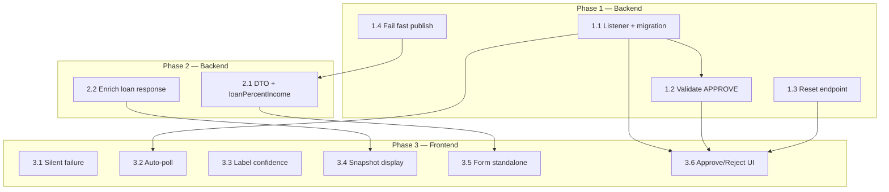

# Kế hoạch Refactor — Luồng Dự đoán (Prediction Flows)

> Tài liệu mô tả kế hoạch refactor cho **2 luồng dự đoán rủi ro khoản vay** trong SmartLend Platform:  
> **Standalone Prediction** (PredictionService) và **Prediction từ Loan** (LoanManagementService).  
>  
> Phạm vi: Backend microservices + Frontend (`smartLend-platform/frontend/`).  
> **Loại trừ tạm thời:** Vấn đề #4 — `loanGrade` nhập tay trên CustomerProfile (chưa tích hợp CIC).

---

## 1. Bối cảnh

### 1.1. Hai luồng hiện tại

| Luồng | Entry point | Ai publish RabbitMQ | Kết quả về LMS |
|-------|-------------|---------------------|----------------|
| **Standalone** | `POST /api/predictions` | PredictionService | Không |
| **Từ Loan** | `POST .../trigger-prediction` | LoanManagementService | Có queue `loan.prediction.completed` (listener hiện no-op) |

### 1.2. Luồng end-to-end (tóm tắt)

**Standalone:**
```
Analyst → POST /api/predictions
  → PredictionService lấy CustomerService (live) + convert VND→USD
  → Lưu PENDING → RabbitMQ → ml-model → model.predict.completed → PredictionService COMPLETED
```

**Từ Loan:**
```
Staff → POST /api/loan-applications (tạo đơn + FinancialSnapshot)
Staff → POST .../trigger-prediction
  → LMS HTTP register-from-loan → PredictionService PENDING
  → LMS publish RabbitMQ → ml-model
  → ml-model → PredictionService + LMS (listener no-op)
Staff → POST .../decision → POST /api/disbursements (nếu APPROVED)
```

### 1.3. Frontend liên quan

| Màn hình | Role | API chính |
|----------|------|-----------|
| `ListPrediction.html` | ANALYSTIC | `POST /api/predictions`, `GET /api/predictions/id/{id}` |
| `ListCustomer.js` → Create Loan modal | STAFF | `POST /api/loan-applications` + `trigger-prediction` |
| `ListLoan.js` | STAFF | `trigger-prediction`, `GET prediction`, `POST decision` |
| `prediction-result-renderer.js` | Chung | Load & render kết quả ML + SHAP/LIME |

---

## 2. Danh sách vấn đề cần xử lý

| ID | Mức độ | Vấn đề | Luồng | Ghi chú |
|----|--------|--------|-------|---------|
| #1 | 🟠 Data | `loanPercentIncome` standalone do analyst nhập tay | Standalone | Backend nên tự tính |
| #2 | 🟠 Data | `loanStatus` trong DTO nhưng ML không dùng | Standalone | Bỏ field khỏi form/DTO |
| #3 | 🟡 UX/BE | RabbitMQ fail → PENDING vĩnh viễn, client nhận 200 OK | Standalone | Fail fast + status FAILED |
| #4 | 🔵 Thiếu | `loanGrade` nhập tay, không từ CIC | Cả hai | **Tạm bỏ qua** |
| #5 | 🔵 Thiếu | Standalone không nối với quyết định loan | Standalone | Out of scope MVP |
| #6 | 🔴 Nghiệp vụ | Trigger prediction fail nhưng UI báo thành công | Loan | Fix FE + BE messaging |
| #7 | 🟡 UX/BE | `LoanPredictionCompletedListener` no-op → `predictionConfidence` luôn null | Loan | Implement listener |
| #8 | 🔵 Thiếu | Không retry khi ML fail giữa chừng | Loan | Reset + re-trigger API |
| #9 | 🔴 Nghiệp vụ | Approve không cần prediction COMPLETED | Loan | Validate trước APPROVE |
| #10 | 🟡 UX | Modal hiển thị customer live, ML dùng FinancialSnapshot | Loan | Enrich response / hiển thị snapshot |
| #11 | 🟠 Data | `loanPercentIncome` tính khác nhau giữa 2 luồng | Cả hai | Thống nhất logic backend |
| #12 | 🟡 UX | Không auto-poll sau trigger/create | Cả hai | Poll 4s trong modal |
| #13 | 🔴 Nghiệp vụ | Label "Độ tin cậy" vs `confidence` = p_default (rủi ro) | Cả hai | Đổi label nhất quán |

---

## 3. Nguyên tắc refactor

1. **Phase 1 (Backend) trước Phase 3 (Frontend)** — FE phụ thuộc API/field mới.
2. **Human-in-the-loop giữ nguyên** — ML gợi ý, staff quyết định; không auto-approve từ model.
3. **REJECT không bắt buộc chờ ML** — Staff có thể từ chối nhanh khi hồ sơ rõ ràng.
4. **APPROVE bắt buộc có kết quả ML** — Đảm bảo quy trình credit scoring có ý nghĩa.
5. **FinancialSnapshot là source of truth cho luồng loan** — UI phải phản ánh data ML đã dùng.
6. **Minimal diff** — Không refactor kiến trúc lớn (giữ LMS publish trực tiếp tới ml-model).

---

## 4. Phase 1 — Backend: Sửa lỗi nghiệp vụ sai

**Mục tiêu:** Đồng bộ kết quả ML vào loan, ràng buộc approve, xử lý lỗi publish, hỗ trợ retry.  
**Ước lượng:** 3–4 ngày.

### Task 1.1 — Implement `LoanPredictionCompletedListener` *(#7)*

**Vấn đề:** Listener hiện no-op; `LoanApplicationResponseDto.predictionConfidence` không bao giờ được populate.

**File cần sửa:**
- `loanmanagementservice/.../entities/LoanApplication.java`
- `loanmanagementservice/.../services/LoanApplicationService.java`
- `loanmanagementservice/.../services/impl/LoanApplicationServiceImpl.java`
- `loanmanagementservice/.../listeners/impl/LoanPredictionCompletedListenerImpl.java`
- `loanmanagementservice/.../dtos/LoanApplicationResponseDto.java`
- Migration SQL (database `loanmanagementservice`)

**Thay đổi:**

1. Thêm column vào `LoanApplication`:
   ```sql
   ALTER TABLE loan_applications
     ADD COLUMN prediction_confidence DOUBLE,
     ADD COLUMN prediction_label      BOOLEAN;
   ```

2. Entity fields:
   ```java
   @Column(name = "prediction_confidence")
   private Double predictionConfidence;  // p_default từ ML

   @Column(name = "prediction_label")
   private Boolean predictionLabel;      // true = Non-Default (an toàn)
   ```

3. Service method mới:
   ```java
   void applyPredictionResult(UUID loanApplicationId, Boolean label, Double probability);
   ```

4. Listener implementation:
   ```java
   @RabbitListener(queues = "${rabbitmq.queue.loan-prediction-completed}")
   public void handleLoanPredictionCompleted(ModelPredictCompletedMessage message) {
       if (message == null || message.getLoanApplicationId() == null || message.getResult() == null) {
           log.warn("[LOAN] Invalid prediction completed message, skipping");
           return;
       }
       loanApplicationService.applyPredictionResult(
           message.getLoanApplicationId(),
           message.getResult().getLabel(),
           message.getResult().getProbability()
       );
   }
   ```

5. Cập nhật `mapToResponse()` populate `predictionConfidence`, `predictionLabel`.

**Acceptance criteria:**
- [ ] Sau ML complete, `GET /api/loan-applications/id/{id}` trả `predictionConfidence` và `predictionLabel` không null.
- [ ] PredictionService vẫn nhận và lưu kết quả qua queue `model.predict.completed` như cũ.

---

### Task 1.2 — Validate APPROVE chỉ khi prediction đã xong *(#9)*

**Vấn đề:** Staff approve được khi ML vẫn PENDING.

**File cần sửa:**
- `loanmanagementservice/.../services/impl/LoanApplicationServiceImpl.java` — `updateDecision()`

**Logic:**
```java
if (request.getDecision() == LoanDecision.APPROVED) {
    if (application.getPredictionId() == null) {
        throw new IllegalStateException("Cannot approve: prediction has not been triggered yet.");
    }
    if (application.getPredictionConfidence() == null) {
        throw new IllegalStateException(
            "Cannot approve: ML prediction result is still PENDING. Please wait and try again.");
    }
}
// REJECT: không yêu cầu prediction xong
```

**Acceptance criteria:**
- [ ] `POST .../decision` với `APPROVED` khi `predictionConfidence == null` → 409/422 với message rõ ràng.
- [ ] `POST .../decision` với `REJECTED` vẫn thành công dù prediction PENDING.

---

### Task 1.3 — Endpoint reset prediction + re-trigger *(#8)*

**Vấn đề:** `predictionId` đã set nhưng ML fail → không trigger lại được.

**File cần sửa:**
- `loanmanagementservice/.../controllers/LoanApplicationController.java`
- `loanmanagementservice/.../services/LoanApplicationService.java`
- `loanmanagementservice/.../services/impl/LoanApplicationServiceImpl.java`

**API mới:**
```
POST /api/loan-applications/id/{id}/reset-prediction
Header: X-User-Id
```

**Logic:**
- Chỉ staff tạo đơn được reset.
- Chỉ reset khi `predictionConfidence == null` (chưa COMPLETED).
- Clear: `predictionId`, `predictionLabel`, `predictionConfidence`.
- Sau reset, client gọi lại `trigger-prediction`.

**Acceptance criteria:**
- [ ] Reset thành công khi prediction stuck PENDING.
- [ ] Reset bị từ chối khi prediction đã COMPLETED.
- [ ] Sau reset + trigger, flow ML chạy lại bình thường.

---

### Task 1.4 — Fail fast khi RabbitMQ publish fail (standalone) *(#3)*

**Vấn đề:** Exception publish bị nuốt → prediction PENDING mãi, client nhận 200.

**File cần sửa:**
- `predictionservice/.../services/impl/PredictionServiceImpl.java` — `createPrediction()`

**Logic:**
```java
try {
    predictionEventPublisher.publishModelPredictRequestedEvent(event);
} catch (Exception publishEx) {
    prediction.setStatus(PredictionStatus.FAILED);
    predictionRepository.save(prediction);
    throw new RuntimeException("Failed to send prediction request to ML model. Please try again later.", publishEx);
}
```

**Acceptance criteria:**
- [ ] RabbitMQ down → `POST /api/predictions` trả lỗi 5xx, DB ghi `FAILED` (không để PENDING vô hạn).
- [ ] Client hiển thị thông báo lỗi rõ ràng.

---

## 5. Phase 2 — Backend: Data integrity

**Mục tiêu:** Thống nhất input ML giữa 2 luồng; enrich loan response với snapshot data.  
**Ước lượng:** 2 ngày.  
**Phụ thuộc:** Task 1.4 (test standalone sau khi DTO đổi).

### Task 2.1 — Auto-calculate `loanPercentIncome`, bỏ `loanStatus` *(#1, #2, #11)*

**File cần sửa:**
- `predictionservice/.../dtos/PredictionRequestDto.java`
- `predictionservice/.../services/impl/PredictionServiceImpl.java`
- `predictionservice/README.md` (cập nhật ví dụ API)

**DTO mới (tối thiểu):**
```java
public class PredictionRequestDto {
    private UUID customerId;       // required
    private LoanIntent loanIntent; // required
    private Double loanAmnt;       // VND
    private Double loanIntRate;
    // REMOVED: loanStatus, loanPercentIncome, customerName, employeeId, employeeName
}
```

**Logic tính `loanPercentIncome` (giống luồng loan):**
```java
Double loanPercentIncome = (profile.getPersonIncome() != null && profile.getPersonIncome() > 0)
    ? request.getLoanAmnt() / profile.getPersonIncome()
    : null;
```

**Model input:** Chỉ 11 field ML cần (bỏ metadata thừa: `customerSlug`, `email`, `loanStatus`).

**Acceptance criteria:**
- [ ] Cùng KH + cùng số tiền/lãi suất → standalone và loan cho cùng `loanPercentIncome`.
- [ ] `loanStatus` không còn trong request/response docs.

---

### Task 2.2 — Enrich `LoanApplicationResponse` với snapshot summary *(#10)*

**Vấn đề:** FE gọi `getCustomerById` (live) trong modal; ML dùng `FinancialSnapshot` (frozen).

**File cần sửa:**
- `loanmanagementservice/.../dtos/LoanApplicationResponseDto.java`
- `loanmanagementservice/.../services/impl/LoanApplicationServiceImpl.java` — `mapToResponse()`

**Thêm field (hoặc nested DTO):**
```java
// Snapshot fields — data ML thực sự dùng tại thời điểm nộp đơn
private Double snapshotPersonIncome;      // USD (đã convert)
private Double snapshotLoanAmnt;          // USD
private Double snapshotLoanPercentIncome;
private Integer snapshotPersonAge;
private String snapshotPersonHomeOwnership;
```

**Acceptance criteria:**
- [ ] `GET /api/loan-applications/id/{id}` trả đủ snapshot summary.
- [ ] FE có thể hiển thị "dữ liệu tại thời điểm nộp đơn" mà không cần thêm round-trip.

---

## 6. Phase 3 — Frontend: UX + hiển thị đúng

**Mục tiêu:** Sửa silent failure, auto-poll, label đúng nghĩa, form standalone gọn.  
**Ước lượng:** 2 ngày.  
**Phụ thuộc:** Phase 1 (Task 1.1, 1.2) và Phase 2 (Task 2.1, 2.2).

### Task 3.1 — Fix silent failure khi trigger prediction *(#6)*

**File:**
- `frontend/src/pages/loan/create/create-loan-renderer.js`
- `frontend/src/pages/customers/list/ListCustomer.js`

**Thay đổi:**
- `submitCreateLoanForm()` trả `{ predictionTriggered, predictionError }` thay vì nuốt lỗi.
- UI message phân biệt:
  - Thành công + trigger OK: *"Tạo đơn vay thành công! Dự đoán AI đang chạy..."*
  - Thành công + trigger fail: *"Tạo đơn vay thành công. Dự đoán chưa chạy được — vào danh sách khoản vay để chạy lại."*

---

### Task 3.2 — Auto-poll kết quả prediction *(#12)*

**File:**
- `frontend/src/pages/loan/predict/prediction-result-renderer.js`
- `frontend/src/pages/loan/list/ListLoan.js`
- `frontend/src/pages/analytics/predictions/list/ListPrediction.js`

**Logic:**
- `startPredictionPolling(loanId, predictionId, els, intervalMs = 4000)`
- Poll `getPredictionById` hoặc `getLoanApplicationById` + prediction.
- Dừng poll khi `predictionResult != null` hoặc đóng modal (`stopPredictionPolling()`).
- Re-render risk card, status badge, SHAP/LIME khi COMPLETED.

---

### Task 3.3 — Sửa label `confidence` *(#13)*

**File:**
- `frontend/src/pages/loan/list/ListLoan.js` — `renderLoanModal()`
- `frontend/src/pages/loan/predict/prediction-result-renderer.js`

**Quy ước hiển thị:**
| Field backend | Ý nghĩa | Label UI |
|-------------|---------|----------|
| `confidence` | `p_default` — xác suất vỡ nợ | **"Xác suất vỡ nợ"** (không dùng "Độ tin cậy") |
| `predictionResult == true` | Non-Default, an toàn | "Có thể phê duyệt" |
| `predictionResult == false` | Default, rủi ro cao | "Rủi ro cao — không nên phê duyệt" |

---

### Task 3.4 — Hiển thị FinancialSnapshot trong loan modal *(#10)*

**File:**
- `frontend/src/pages/loan/predict/prediction-result-renderer.js` — `renderLoanDetails()`, `renderCustomerProfile()`

**Logic:**
- Ưu tiên `loan.snapshot*` từ response (Task 2.2).
- Fallback `customer` live nếu snapshot field chưa có (backward compat).
- Ghi chú UI: *"(tại thời điểm nộp đơn)"*.

---

### Task 3.5 — Cập nhật form standalone prediction *(#1, #2)*

**File:**
- `frontend/src/pages/analytics/predictions/list/ListPrediction.html`
- `frontend/src/pages/analytics/predictions/list/ListPrediction.js`
- `frontend/src/services/prediction.service.js`

**Thay đổi:**
- Xóa field `cp-loan-status`, `cp-loan-percent-income` khỏi form.
- Payload chỉ còn: `customerId`, `loanIntent`, `loanAmnt`, `loanIntRate`.
- Bỏ query param `staffName` trong `createPrediction()` (backend không dùng).
- Thêm note: *"Tỷ lệ vay/thu nhập được tính tự động từ hồ sơ khách hàng."*

---

### Task 3.6 — Cập nhật điều kiện Approve/Reject trên ListLoan *(#9)*

**File:**
- `frontend/src/pages/loan/list/ListLoan.js`

**Logic:**
```javascript
const canApprove =
    canWrite() &&
    loan.status === 'UNDER_REVIEW' &&
    (!loan.decision || loan.decision === 'PENDING') &&
    loan.predictionLabel != null;

const canReject =
    canWrite() &&
    (loan.status === 'UNDER_REVIEW' || loan.status === 'PENDING') &&
    (!loan.decision || loan.decision === 'PENDING');
```

- Nút Approve disabled + tooltip khi prediction chưa xong.
- Nút "Chạy lại dự đoán" khi `predictionId` có nhưng `predictionLabel == null` (gọi reset + trigger).

---

## 7. Thứ tự thực hiện & phụ thuộc



**Thứ tự đề xuất (sprint):**

| Sprint | Tasks | Deliverable |
|--------|-------|-------------|
| Sprint 1 | 1.1, 1.2, 1.4 | Loan nhận ML result; approve có guard; standalone fail rõ |
| Sprint 2 | 1.3, 2.1, 2.2 | Reset/retry; DTO thống nhất; snapshot trong response |
| Sprint 3 | 3.1 → 3.6 | FE hoàn chỉnh: poll, label, form, approve UX |

---

## 8. Bảng tổng hợp task

| Task | Vấn đề | Layer | File chính | Effort |
|------|--------|-------|------------|--------|
| 1.1 | #7 | BE | `LoanApplication.java`, `LoanPredictionCompletedListenerImpl.java` | L |
| 1.2 | #9 | BE | `LoanApplicationServiceImpl.updateDecision()` | S |
| 1.3 | #8 | BE | `LoanApplicationController`, `resetPrediction()` | M |
| 1.4 | #3 | BE | `PredictionServiceImpl.createPrediction()` | S |
| 2.1 | #1 #2 #11 | BE | `PredictionRequestDto`, `PredictionServiceImpl` | M |
| 2.2 | #10 | BE | `LoanApplicationResponseDto`, `mapToResponse()` | S |
| 3.1 | #6 | FE | `create-loan-renderer.js`, `ListCustomer.js` | S |
| 3.2 | #12 | FE | `prediction-result-renderer.js` | M |
| 3.3 | #13 | FE | `ListLoan.js`, `prediction-result-renderer.js` | XS |
| 3.4 | #10 | FE | `prediction-result-renderer.js` | S |
| 3.5 | #1 #2 | FE | `ListPrediction.html/js`, `prediction.service.js` | S |
| 3.6 | #9 | FE | `ListLoan.js` | S |

> **Effort:** XS &lt; 2h · S = 2–4h · M = 4–8h · L &gt; 1 ngày

---

## 9. Test plan

### 9.1. Backend (Postman / integration)

| # | Scenario | Expected |
|---|----------|----------|
| 1 | Create loan → trigger → đợi ML | `predictionConfidence`, `predictionLabel` populated on loan |
| 2 | Approve khi `predictionConfidence == null` | 409/422 |
| 3 | Reject khi prediction PENDING | 200 OK |
| 4 | Reset prediction khi stuck → trigger lại | ML chạy lại, kết quả mới |
| 5 | Reset khi đã COMPLETED | 409 |
| 6 | Standalone create khi RabbitMQ down | 5xx, prediction status FAILED |
| 7 | Standalone cùng input với loan flow | Cùng `loanPercentIncome` trong inputData |

### 9.2. Frontend (manual)

| # | Scenario | Expected |
|---|----------|----------|
| 1 | Tạo loan, trigger fail | Message cảnh báo, không claim "đã kích hoạt dự đoán" |
| 2 | Mở modal prediction sau trigger | Auto-poll → hiện kết quả trong ~10s |
| 3 | Approve disabled cho đến khi ML xong | Nút gray + tooltip |
| 4 | Label hiển thị "Xác suất vỡ nợ" | Không còn "Độ tin cậy" gây hiểu nhầm |
| 5 | Form standalone | Không còn loanStatus, loanPercentIncome |
| 6 | Loan modal | Hiển thị snapshot income với note "tại thời điểm nộp đơn" |

---

## 10. Out of scope (phase sau)

| Hạng mục | Lý do |
|----------|-------|
| #4 — Tích hợp CIC / auto `loanGrade` | Cần hệ thống bên ngoài |
| #5 — Nối standalone prediction → loan decision | Cần thiết kế workflow mới |
| Auto-trigger prediction khi create loan (backend) | Giữ 2 bước hoặc merge sau khi ổn định |
| WebSocket thay poll | Poll đủ cho MVP |
| Saga/compensation register-from-loan + RabbitMQ | Phức tạp, làm sau |
| Role-based auth trên Customer/Loan/Prediction services | Tách task bảo mật riêng |

---

## 11. Tài liệu cần cập nhật sau refactor

- [ ] `README.md` (root) — luồng tạo loan + trigger riêng
- [ ] `predictionservice/README.md` — DTO mới, bỏ `loanStatus`
- [ ] `loanmanagementservice/README.md` — field mới, reset endpoint, guard approve
- [ ] `docs/ARCHITECTURE.md` — listener LMS active, state machine loan
- [ ] Postman collection trong `loanmanagementservice/README.md`

---

## 12. Semantics tham chiếu (ML ↔ API ↔ UI)

```
ml-model:
  label       = prediction != 'Default'  → true = an toàn (Non-Default)
  probability = p_default                → càng cao = càng rủi ro vỡ nợ

PredictionService / LoanApplication:
  predictionResult  = label
  confidence        = probability (p_default)

UI:
  "Xác suất vỡ nợ: 75%"  → rủi ro cao, cân nhắc reject
  "PHÊ DUYỆT" badge      → predictionResult === true
```

---

*Tài liệu tạo: 2026-06-29 · SmartLend Platform*
